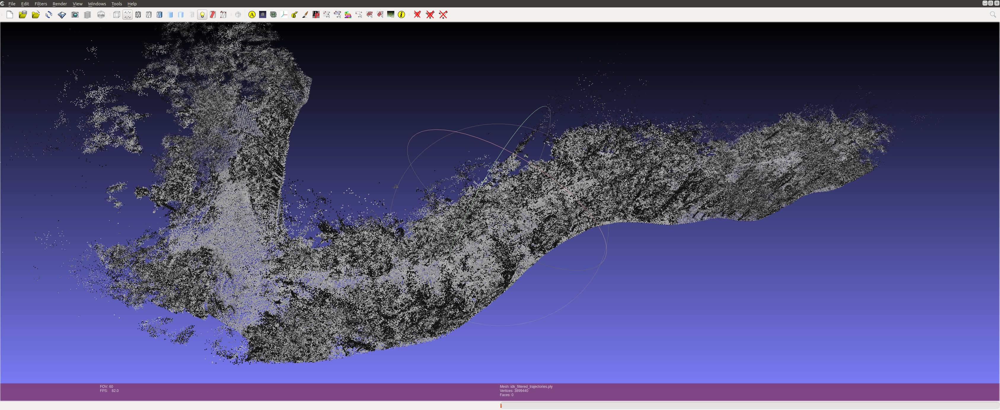

The point of this repo is to preprocess vehicle data properly to input it into nvidia's NKSR algorithm for surface reconstruction from pointclouds. Still prototyping because the level of detail and point density we're dealing with requires some hefty gpu VRAM but small subsets can be run locally with a modest gpu. https://research.nvidia.com/labs/toronto-ai/NKSR/

# read_bag_file_output_pointcloud_and_trajectory_ply.py 
reads in a bag file with '/lvi_sam/lidar/mapping/cloud_registered' and '/lvi_sam/lidar/mapping/odometry' topics. This assumes you've re-recorded a raw bag file with LVI-MSU running.
It concatenates all of the world-registered pointclouds into a single pointcloud and performs a simple knn outlier removal favoring clusters of points near each other. 
Because the 'cloud_registered' and 'mapping/odometry' topics are both produced in tandem by LVI (roughly 10hz), there is a pointcloud for every odometry message. This feature is used to extract the x, y, z location of the sensor for every point. The pointcloud is then written to a .ply binary file with the following header:

ply
format binary_little_endian 1.0
element vertex
property float x
property float y
property float z
property float sensor_x
property float sensor_y
property float sensor_z
end_header

This will be used by extract_vehicle_path_points later for calculating the normals of each point. It is written to a ply for later processing because this step requires ROS packages that rely on python2 and are incompatible with the pytorch2.0 / python3 conda environment used later. 

# extract_vehicle_path_points.py 
is intended to be run in a conda environment and uses pytorch and cuda to efficiently offload pointcloud processing to the gpu (RTX 3070 in my case, mileage may vary with non-ampere architecture cards). This program reads in the PLY created by read_bag_file_output_pointcloud_and_trajectory_ply.py and calculates an estimate of the normal for each point based on the x,y,z location of the sensor for that point and filters out points with invalid normals. Then in the filter_points_near_trajectory_grid function it applies a simple masking filter that will discard any point that is outside a given radius around the vehicle. This can be improved quite a bit but it works in a reasonable time with cuda.

if you view the resulting ply in meshlab it should look something like this depending on your radius filter and the path you took.

extract_sensor_poses_per_scan reads in a bag file, subscribes to the /lvi_sam/lidar/mapping/odometry topic, and simply outputs the x,y,z location to a txt file.

